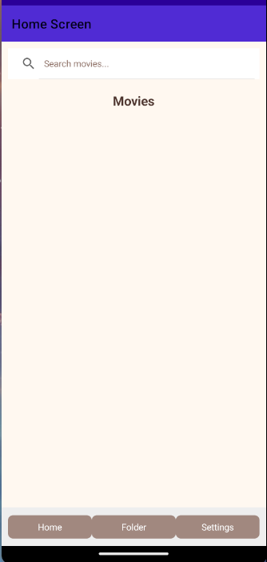

# Movie Search App (.NET MAUI)


A cross-platform mobile application built with **C# and .NET MAUI** that allows users to search movies using an external API, view movie details, and manage favourite movies locally.

---

# Overview

This project demonstrates how to build a mobile application that integrates with a **REST API**, processes **JSON data**, and stores user data locally using **SQLite**.

The application was designed to simulate a real-world mobile app workflow including API integration, data persistence, and basic testing.

---

# Features

• Search movies using OMDb API  
• Display movie details  
• Save favourite movies locally  
• Add / Delete saved records  
• Local data storage using SQLite  

---

# Application Pages

- Search Page 
- Movie Details   
- Movie List  
- Settings Page  

---

# Tech Stack

**Language**
- C#

**Framework**
- .NET MAUI

**API**
- OMDb REST API

**Data**
- JSON
- SQLite

**Architecture**
- MVC pattern

**Testing**
- Postman API testing

---

# Screenshots

## sample Search Page


---

## Testing

This project also includes API testing using Postman.

### Testing covered
- Valid movie search requests
- Invalid or empty search input
- API response handling
- JSON response validation
- Error and edge-case scenarios

### Tools used
- Postman
- Manual functional testing

### Example test scenarios
- Search with a valid movie title
- Search with an empty query
- Search with special characters
- Validate missing or incomplete API response fields

Postman collection is included in the `api-tests` folder.

Example request:
http://www.omdbapi.com/?i=tt3896198&apikey=fd3b3c04


Example Postman test:

```javascript
pm.test("Status code is 200", function () {
    pm.response.to.have.status(200);
});